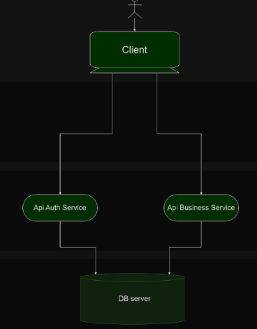
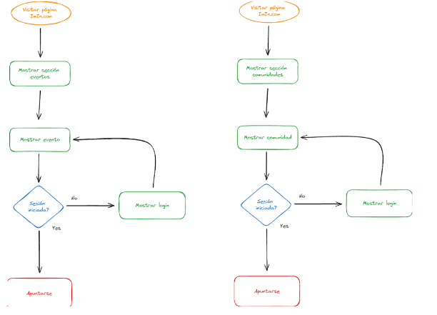
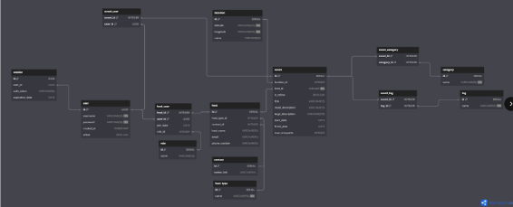
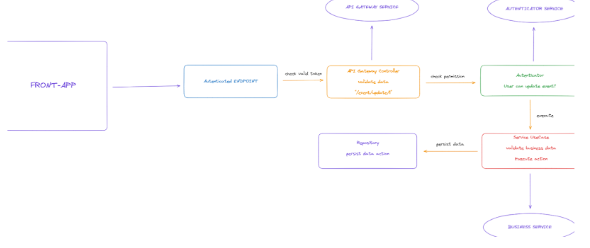
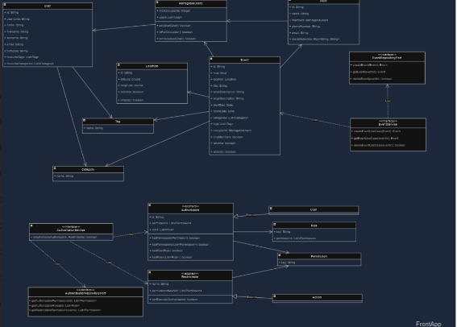

# Gestión de Eventos, Planes y Comunidades

Este proyecto consiste en el desarrollo de una aplicación web para la gestión de eventos, planes y comunidades. La aplicación tiene como objetivo principal facilitar la organización, promoción y participación en eventos locales, mejorando así la interacción social y la conexión entre las personas y su entorno.

## Imporante

El proyecto está formado por dos aplicaciones principales: una [api](https://github.com/ClearCB/imin-app-api) hecha en Java y una [app](https://github.com/ClearCB/imin-app) hecha en Angular. Además, forma parte de una entrega de un trabajo de fin de grado superior de Desarrollo de Aplicaciones web. Haga [click aquí](./docs/ImIn-V1.0-Abel-Casas.pdf) para más información sobre el mismo.

## Tecnologías Utilizadas

- **Backend**: Spring Framework con Java 21
- **Frontend**: Angular 17
- **Base de Datos**: PostgreSQL
- **Autenticación y Autorización**: Spring Security y JWT
- **CI/CD**: Docker, Docker Compose, GitHub Actions
- **Despliegue**: VPS de IONOS con Nginx y Certbot para HTTPS

## Principios y Buenas Prácticas

El proyecto se ha desarrollado siguiendo los principios SOLID y otras buenas prácticas de programación para asegurar una arquitectura robusta, mantenible y escalable. Además, se ha realizado un análisis exhaustivo del dominio y se ha generado un diagrama E-R detallado.

## Estructura del Proyecto

### Backend (API en Spring)

El backend se ha desarrollado utilizando Spring Framework, adoptando una arquitectura en capas (Controller, Service, Repository) que facilita la separación de preocupaciones y mejora la mantenibilidad.

#### Características del Backend

- **RESTful API**: Implementación de endpoints RESTful siguiendo los estándares HTTP.
- **Spring Boot**: Para una configuración simplificada y un despliegue rápido.
- **Spring Data JPA**: Para la persistencia de datos con PostgreSQL.
- **Spring Security**: Para la gestión de autenticación y autorización.
- **JWT (JSON Web Tokens)**: Para la implementación de un sistema de autenticación robusto.
- **Validación**: Uso de Hibernate Validator para la validación de datos de entrada.

#### Endpoints Principales

- `/api/events`: Gestión de eventos (creación, actualización, eliminación, listado).
- `/api/auth`: Autenticación y autorización (login, registro, validación de tokens).

### Frontend (Aplicación en Angular)

La aplicación frontend está desarrollada en Angular, proporcionando una interfaz de usuario intuitiva y responsive.

#### Características del Frontend

- **SPA (Single Page Application)**: Experiencia de usuario fluida y rápida.
- **Angular CLI**: Herramientas de línea de comandos para facilitar el desarrollo y el despliegue.
- **Componentes Reutilizables**: Diseño de componentes modulares y reutilizables.
- **Servicios y RxJS**: Gestión eficiente de datos y comunicación con el backend.
- **Rutas Protegidas**: Implementación de guardas para rutas que requieren autenticación.

### Integración y Despliegue (CI/CD con Docker)

Se ha implementado un entorno de CI/CD utilizando Docker y Docker Compose para asegurar despliegues consistentes y reproducibles.

#### Características del CI/CD

- **Docker**: Contenedorización de aplicaciones para un entorno homogéneo.
- **Docker Compose**: Orquestación de contenedores para el desarrollo y pruebas locales.
- **GitHub Actions**: Configuración de pipelines para la integración continua. Construcción de imágenes Docker de ambas partes de la aplicación.

### Despliegue en VPS de IONOS

El despliegue de la aplicación se ha realizado en un VPS de IONOS utilizando Nginx como servidor web y Certbot para la gestión de certificados SSL.

#### Pasos del Despliegue

1. **Preparación del VPS**: Configuración inicial del servidor, incluyendo actualización de paquetes y configuración de firewall.
2. **Dockerización**: Creación de imágenes Docker para backend, frontend y base de datos.
3. **Nginx**: Configuración de Nginx como reverse proxy para enrutar el tráfico a los contenedores correspondientes.
4. **SSL**: Implementación de HTTPS utilizando Certbot y Let's Encrypt.

## Funcionalidades Principales

- **Exploración de Eventos**: Los usuarios pueden buscar y descubrir eventos locales utilizando filtros por localización y fechas.
- **Geolocalización**: Implementación de un sistema de geolocalización preciso para descubrir lugares y eventos cercanos.
- **Registro y Participación**: Proceso sencillo para que los usuarios se registren y participen en eventos.
- **Notificaciones**: Sistema de notificaciones para mantener informados a los usuarios sobre eventos y actualizaciones.

## Fases del Proyecto

### 1. Planificación

Definición de objetivos, alcance y cronograma de trabajo. Identificación de stakeholders y establecimiento de requisitos iniciales.

### 2. Análisis

Análisis exhaustivo de los requisitos del proyecto y necesidades de los usuarios. Elaboración del modelo de dominio y generación del diagrama E-R.

### 3. Diseño

Creación de la arquitectura del sistema y elaboración de prototipos. Diseño de la base de datos y planificación de la estructura del código.

### 4. Desarrollo

Implementación de funcionalidades siguiendo principios SOLID y buenas prácticas de programación. Desarrollo iterativo e incremental con revisiones constantes. Se ha utilizado arquitectura hexagonal tanto en el front como en el back, lo que ha permitido desarrollar de manera robusta y flexible. Esta elección arquitectónica asegura que el sistema pueda escalar y adaptarse fácilmente a futuras funcionalidades y cambios. La aplicación se ha desarrollado hasta la primera gran funcionalidad, los "eventos", con una base sólida que facilita la expansión futura.

### 5. Lanzamiento

Despliegue en VPS y promoción de la aplicación. Configuración de monitorización y análisis de métricas para evaluar el rendimiento y la aceptación por parte de los usuarios.
